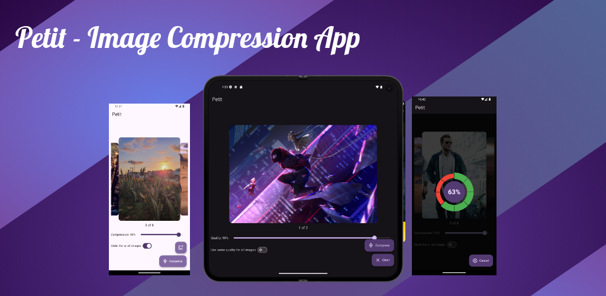
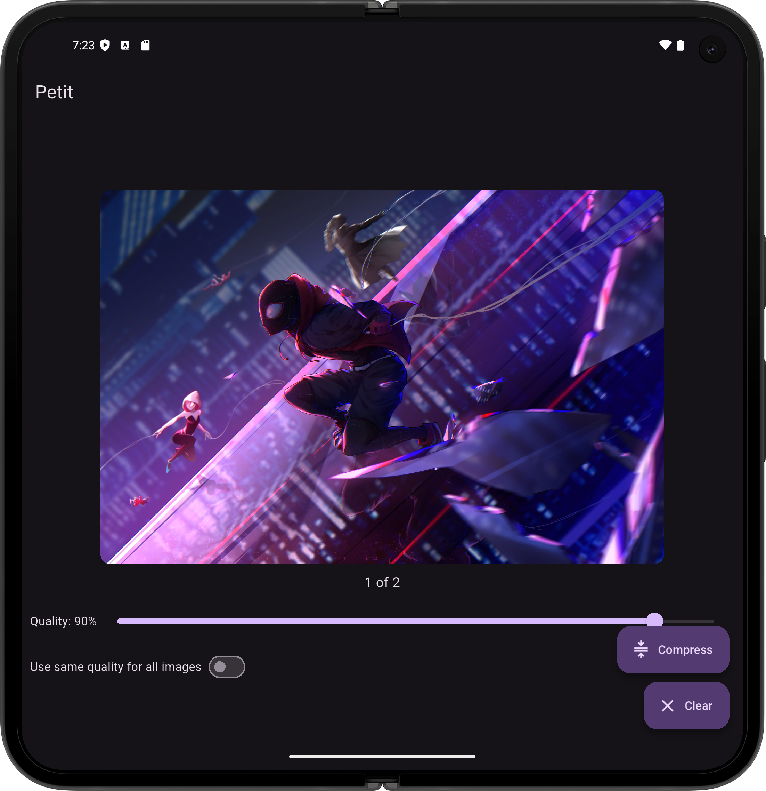
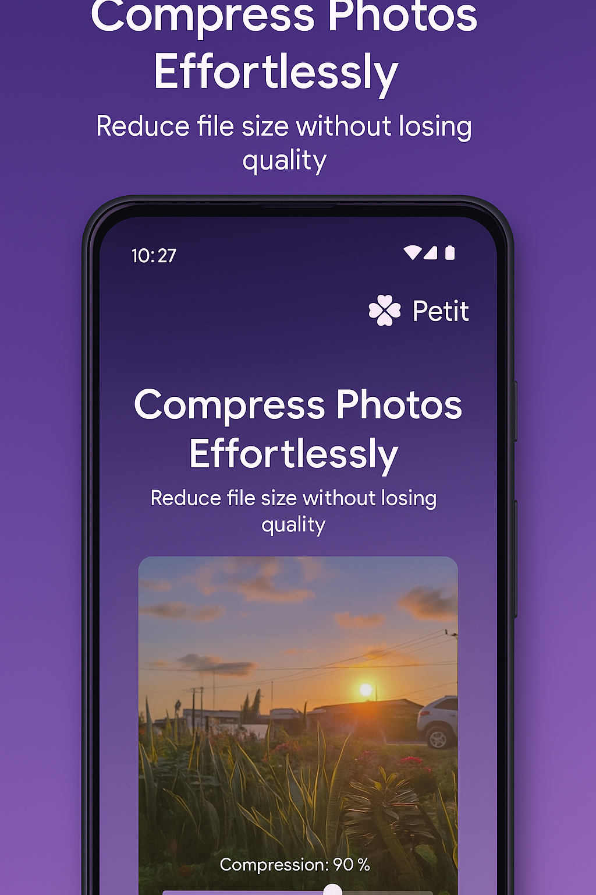
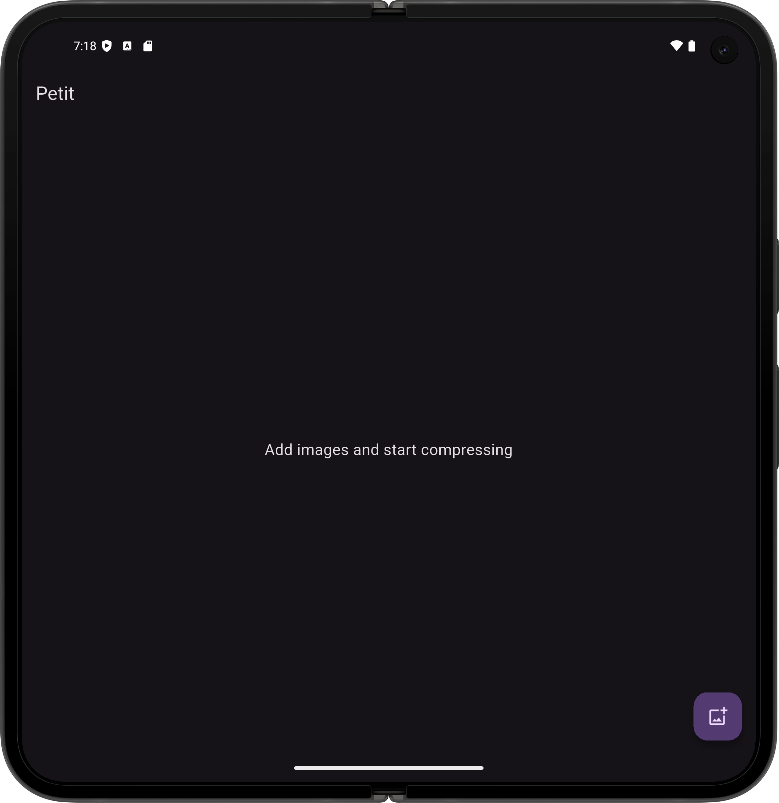
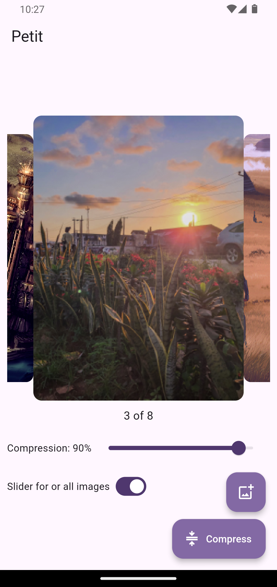
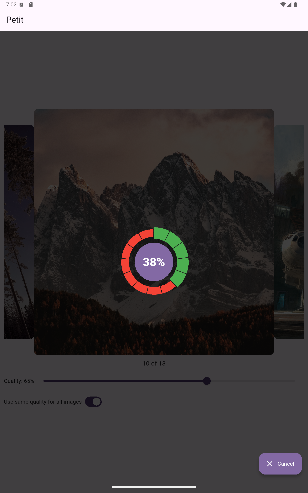

<br />
<div>
  &emsp;&emsp;&emsp;
  <a href="https://play.google.com/store/apps/details?id=com.outsidetheide.petit" target="_blank" rel="nofollow noopener noreferrer"
aria-label="Live Demo - Play Store"> <u>Live Demo 🚀 - Play Store</u></a>
  &emsp;&emsp;&emsp;&emsp;
  <a href="https://appetize.io/app/b_5q7h4bxybf3vgeckafpxufi7xe?device=pixel7&osVersion=15.0" target="_blank"
rel="nofollow noopener noreferrer" aria-label="Live Demo - Appetize.io"><u>Live Demo 🚀 - Appetize.io</u></a>  
</div>
<br />


# PETIT

A Flutter image and video compression application capable of compressing videos and images of various formats, like HEIC, HEIF, PNG, and JPG, for efficient storage and faster file transfers without compromising quality

--- 
### Or
---
This app makes your images and videos smaller in size so they take up less space and send faster — without losing quality. And it works completely offline.

It works with different types of images like JPG, PNG, HEIF, and HEIC or videos like H265, H265 or VP9.

Just choose your pictures or video, pick the quality you want, tap “Compress,” and your smaller images will be saved automatically.

--- 
### Note
---
(webp compression is not very effecient)

## Screenshots
<br />
<div>
  &emsp;&emsp;&emsp;
  
  &emsp;&emsp;&emsp;&emsp;
    
</div>
<br />

<br />
<div>
  &emsp;&emsp;&emsp;
  
  &emsp;&emsp;&emsp;&emsp;
    
</div>
<br />




### Packages
- [Flutter Super] for state management  
- [Image Picker] to select images to compress both locally and cloud (on android)
- [Flutter Image Compress] for compressing WEBP (may not be efficient), PNG, and JPG
- [Heif Converter Plus] to convert HEIF and HEVC to JPEG because [Flutter Image Compress] does not support HEVC or HEIF at the time
- [Gallery Saver Plus] to save the compressed files to phone storage after compression
- [Image] to decode/encode image files for functions like getting resolution details and resizing
- [Step Progress Indicator] to show a customised progress bar
- [Carousel Slider] to show the images to be compressed in a beautiful scrollable carousel

[Flutter Super]: https://pub.dev/documentation/flutter_super/latest/
[Image Picker]: https://pub.dev/packages/image_picker
[Flutter Image Compress]: https://pub.dev/packages/flutter_image_compress
[Heif Converter Plus]: https://pub.dev/packages/heif_converter_plus
[Gallery Saver Plus]: https://pub.dev/packages/gallery_saver_plus
[crashlytics]: https://pub.dev/packages/image
[Step Progress Indicator]: https://pub.dev/documentation/step_progress_indicator/latest/
[Carousel Slider]: https://pub.dev/packages/carousel_slider

# First Run

After installing the package dependencies with

```
flutter pub get
```

```
flutter pub run build_runner build
```

