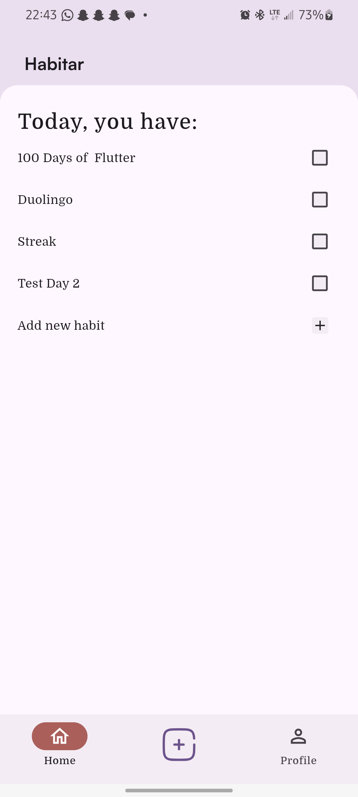
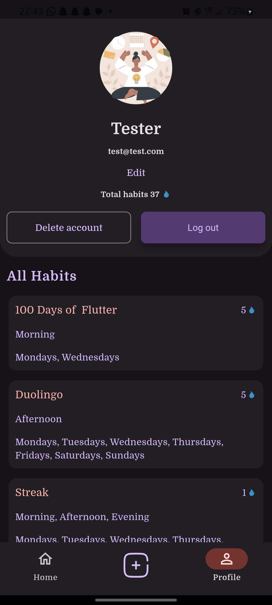

# petit
 To be added later

It supports png, webp, jpeg, jpg, heic, and heif formats. So I added an error massage for unsupported formats. I also found out that the webp compression is not very effecient.

<a href="https://appetize.io/app/b_5q7h4bxybf3vgeckafpxufi7xe?device=pixel7&osVersion=15.0" target="_blank"
rel="nofollow noopener noreferrer" aria-label="Live Demo"><u>Live Demo 🚀(Coming soon)</u></a>

A Flutter image compression application capable of compressing images in various formats, like HEIC, HEIF, PNG, and JPG, for efficient storage and faster file transfers without compromising quality

### Packages
- [Flutter Super] for state management  
- [Image Picker] to select images to compress both locally and cloud (on android)
- [Flutter Image Compress] for compressing WEBP (may not be efficient), PNG, and JPG
- [Heif Converter Plus] to convert HEIF and HEVC to JPEG because [Flutter Image Compress] does not support HEVC or HEIF at the time
- [Gallery Saver Plus] to save the compressed files to phone storage after compression
- [Image] to decode/encode image files for functions like getting resolution details and resizing
- [Step Progress Indicator] to show a customised progress bar
- [Carousel Slider] to show the images to be compressed in a beautiful scrollable carousel

[Flutter Super]: https://pub.dev/documentation/flutter_super/latest/
[Image Picker]: https://pub.dev/packages/image_picker
[Flutter Image Compress]: https://pub.dev/packages/flutter_image_compress
[Heif Converter Plus]: https://pub.dev/packages/heif_converter_plus
[Gallery Saver Plus]: https://pub.dev/packages/gallery_saver_plus
[crashlytics]: https://pub.dev/packages/image
[Step Progress Indicator]: https://pub.dev/documentation/step_progress_indicator/latest/
[Carousel Slider]: https://pub.dev/packages/carousel_slider

<br />
<div>
  &emsp;&emsp;&emsp;
  
  &emsp;&emsp;&emsp;&emsp;
    
</div>
<br />

# First Run

After installing the package dependencies with

```
flutter pub get
```

```
flutter pub run build_runner build
```

